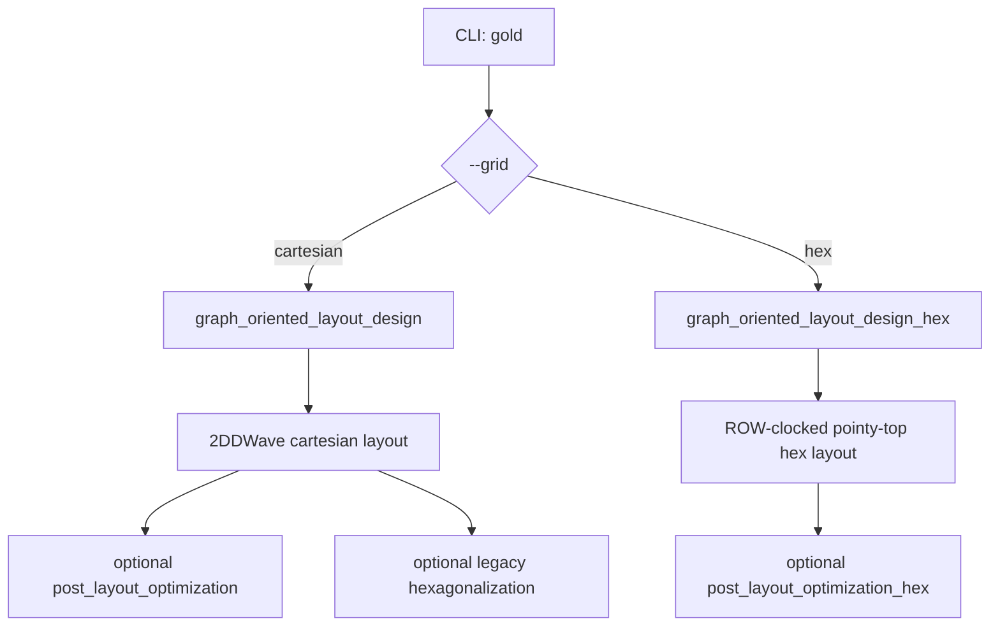
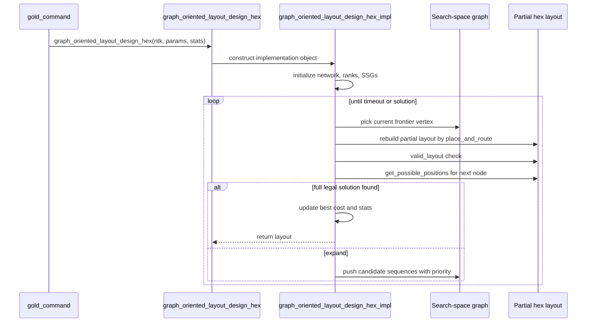
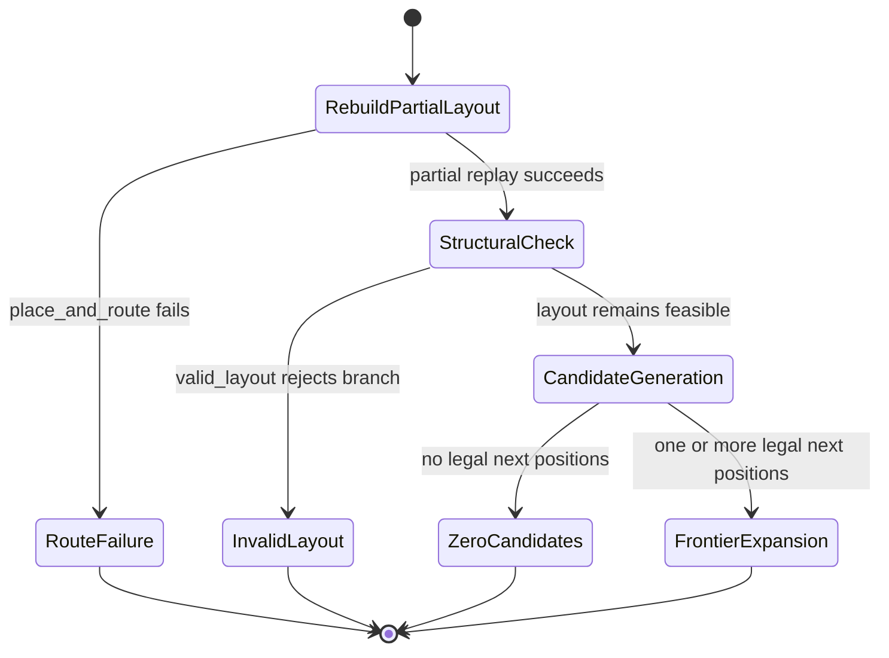
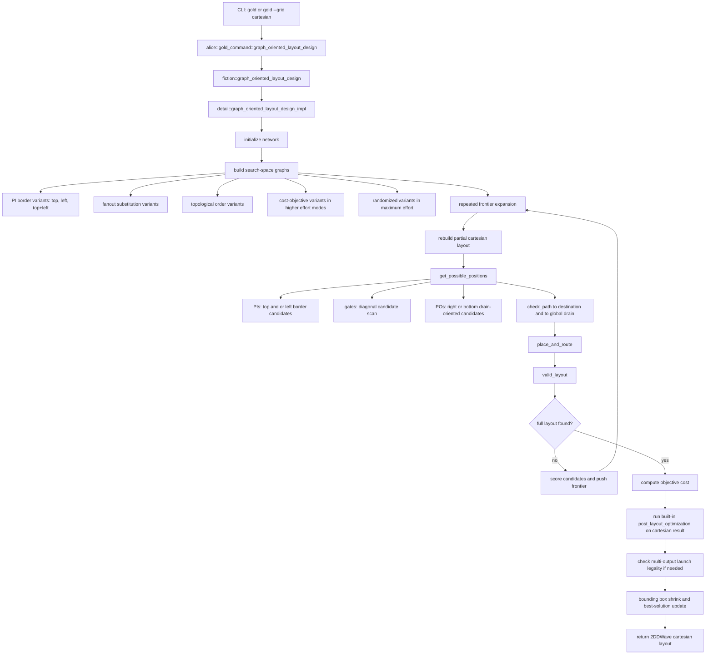
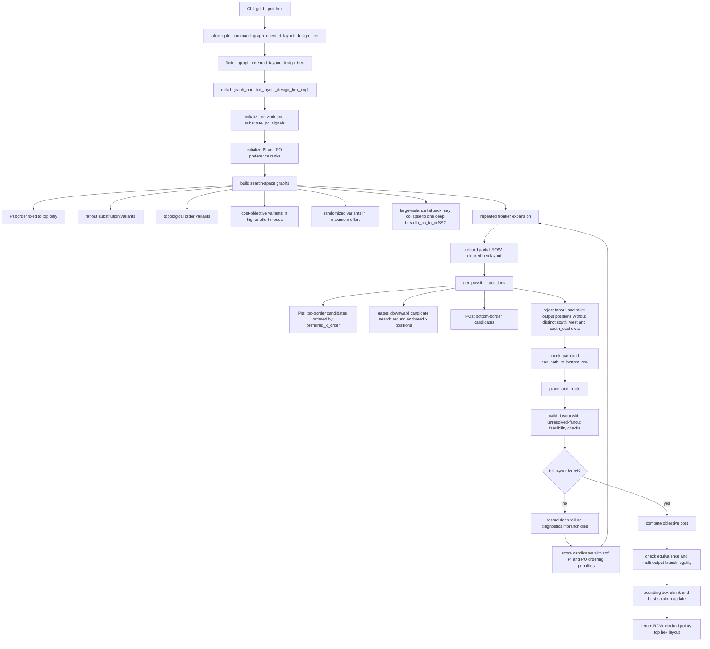
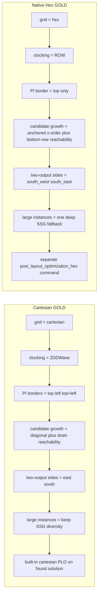

# Hexagonal GOLD Explanation

## Purpose and scope

This document explains the current native hexagonal GOLD implementation in `fiction`: what it is, how it works today, how it differs from the cartesian GOLD flow, what has been tried to make it work better, and which pain points have already been removed versus which ones still remain.

In this document, "hexagonal GOLD" means the direct native-hex placement-and-routing path selected by `gold --grid hex`, implemented by:

- `alice::gold_command` in `cli/cmd/physical_design/src/gold.cpp`
- `fiction::graph_oriented_layout_design_hex` in `include/fiction/algorithms/physical_design/graph_oriented_layout_design_hex.hpp`

This is different from the legacy flow:

1. run cartesian GOLD with `fiction::graph_oriented_layout_design`
2. then convert the result with `fiction::hexagonalization`

It is also different from the separate native-hex orthogonal placer/router implemented in `include/fiction/algorithms/physical_design/orthogonal_hex.hpp`. That orthogonal flow shows up in some repo notes because it exposed similar projected-port legality issues, but it is not the same algorithm as native hex GOLD.

## Executive summary

The current native hex GOLD flow is a dedicated A*-style search over partial row-clocked pointy-top hex layouts. It is not a thin wrapper around the cartesian implementation. The hex version has its own scheduling rules, candidate-generation rules, legality checks, search-space budgeting, large-instance fallback, and failure diagnostics.

The most important differences versus cartesian GOLD are:

- primary inputs are placed on the top border only
- the layout uses `ROW` clocking, not `2DDWave`
- future routability is tested against "reach bottom row" instead of "reach global drain"
- fanouts and multi-output gates must preserve two distinct projected exits (`south_west` and `south_east`)
- two-output launch legality is enforced using projected hex sides
- large wide circuits collapse to one deep search-space graph instead of spending the timeout across many shallow variants

The most important current outcome is that native hex GOLD is much more robust than the earliest versions of this work, but large fanout-heavy instances still fail late in the search because unresolved fanout chains lose future escape capacity. The implementation now diagnoses that failure much better than before, but it does not fully solve it yet.

## Where the implementation lives

Core entry points and data structures:

- `alice::gold_command` in `cli/cmd/physical_design/src/gold.cpp`
- `fiction::graph_oriented_layout_design_params` in `include/fiction/algorithms/physical_design/graph_oriented_layout_design.hpp`
- `fiction::graph_oriented_layout_design_stats` in `include/fiction/algorithms/physical_design/graph_oriented_layout_design.hpp`
- `fiction::graph_oriented_layout_design` in `include/fiction/algorithms/physical_design/graph_oriented_layout_design.hpp`
- `fiction::graph_oriented_layout_design_hex` in `include/fiction/algorithms/physical_design/graph_oriented_layout_design_hex.hpp`

Adjacent native-hex follow-up steps:

- `fiction::post_layout_optimization_hex` in `include/fiction/algorithms/physical_design/post_layout_optimization_hex.hpp`
- `fiction::hexagonalization` in `include/fiction/algorithms/physical_design/hexagonalization.hpp`

Key regression and behavior tests:

- `test/algorithms/physical_design/graph_oriented_layout_design_hex.cpp`
- `test/algorithms/physical_design/post_layout_optimization_hex.cpp`
- `test/utils/hex_layout_port_legality.hpp`

## High-level flow

## How the current hexagonal GOLD implementation works

### 1. CLI dispatch and parameter handling

`alice::gold_command` parses the usual GOLD options once, then dispatches on `--grid`:

- `--grid cartesian` calls `alice::gold_command::graph_oriented_layout_design`
- `--grid hex` calls `alice::gold_command::graph_oriented_layout_design_hex`

Both paths share `fiction::graph_oriented_layout_design_params` and `fiction::graph_oriented_layout_design_stats`, so the user-facing knobs are mostly the same:

- effort mode
- cost objective
- timeout
- return-first
- planar
- multithreading
- seed
- straight-inverters
- PI/PO ordering preferences
- PI gap controls

The hex path also writes richer failure diagnostics into `graph_oriented_layout_design_stats`, and `gold_command::log` already serializes those fields.

### 2. Network normalization and pin-order setup

Inside `detail::graph_oriented_layout_design_hex_impl`:

- the input network is normalized by `initialize_network`
- `ntk.substitute_po_signals()` is applied
- `initialize_input_pin_order_ranks`
- `initialize_output_pin_order_ranks`

Important detail: explicit PI and PO order lists are treated as soft preferences, not as hard schedule rewrites. This is deliberate. The code in `initialize_networks_and_nodes_to_place` explicitly avoids reordering the full PI schedule when `input_pin_order` is provided, because that turned out to distort large native-hex runs too strongly.

### 3. Search-space graph budgeting

The cartesian implementation explores more schedule diversity. Native hex intentionally uses fewer search-space graphs because hard instances were starving for depth.

The native hex implementation currently uses these budgets inside `graph_oriented_layout_design_hex_impl`:

- `HIGH_EFFICIENCY`: `1`
- `HIGH_EFFORT`: `4`
- `HIGHEST_EFFORT`: `16`
- `MAXIMUM_EFFORT`: `32`

For large wide circuits, `should_prioritize_search_depth` overrides that and collapses the run to a single deep search-space graph when both of these are true:

- `ntk.num_pis() >= 32`
- `ntk.num_gates() >= 150`

The old pilot-and-prune idea still exists structurally through `should_use_search_depth_pilot` and `prune_to_best_search_space_graph`, but `should_use_search_depth_pilot` currently returns `false`, so the active behavior is the one-deep-search fallback.

### 4. Search-space graph construction

Native hex still explores multiple structural variants, but fewer than cartesian:

- fanout substitution strategies: breadth and depth
- topological directions: `co_to_ci` and `ci_to_co`
- in maximum effort, additional randomized variants

For large circuits under the depth-prioritizing fallback, the implementation currently hardwires the single search-space graph to the `breadth_co_to_ci` family because that performed better than the alternatives during the recorded experiments.

Another important hex-specific change is node scheduling. The helper inside `initialize_networks_and_nodes_to_place` tries to schedule PI nodes before the internal node that first consumes them, instead of simply appending all PIs and then all gates in the plain cartesian way. That makes the hex search more consumer-anchored.

### 5. Partial-layout search

The search state is a partial placement sequence stored in a search-space graph frontier. `run` repeatedly:

1. expands active search-space graphs
2. processes their best frontier vertex
3. reconstructs the partial layout represented by that vertex
4. generates feasible next placements
5. pushes those next placement sequences back into the frontier with a priority

This is the same broad GOLD idea as cartesian, but the feasibility tests are materially different in the hex path.

### 6. Candidate generation rules

The core candidate-generation entry point is `get_possible_positions`, which dispatches to:

- `get_possible_positions_pis`
- `get_possible_positions_pos`
- `get_possible_positions_single_fanin`
- `get_possible_positions_double_fanin`

The main native-hex rules are:

- PIs are top-border only
- POs are bottom-border only
- internal nodes search primarily downward
- candidate x positions are searched in `preferred_x_order`, centered around already placed drivers or siblings
- every new candidate must preserve some path to the bottom row via `has_path_to_bottom_row`

That last rule is a major conceptual difference from cartesian GOLD. Cartesian candidate generation checks whether the new node can still reach a global drain tile. Native hex checks whether the node can still reach some tile on the bottom border, because bottom-row collection is the structural completion target in this geometry.

### 7. Distinct projected exits for fanouts and two-output gates

Native hex adds a structural legality filter that cartesian GOLD does not need:

- `has_distinct_projected_output_exits`

This filter rejects fanout and multi-output candidate positions whose projected `south_west` and `south_east` exits are not both distinct. This is especially important at the left boundary, where one projected exit can geometrically collapse back onto the source tile itself.

This filter matters because fanouts and true two-output gates in pointy-top hex layouts are expected to preserve one future branch through `south_west` and one through `south_east`. If the position cannot support that before routing starts, the search should not waste time on it.

### 8. Route legality and launch-side legality

Actual routing is performed through A* inside `check_path`. For hex, the implementation uses:

- `manhattan_distance_functor`
- `unit_cost_functor`
- optional crossing suppression when `planar` is set

For multi-output sources, the first step of a route is checked by:

- `determine_launch_side`
- `collect_multioutput_launch_usage`
- `uses_legal_multioutput_launch_side`
- `has_valid_multioutput_launches`

The native hex launch model is:

- output branches may launch through `south_west` or `south_east`
- each side may be used at most once
- a two-output gate must not drive both outputs through the same projected side

This is the native-hex equivalent of the cartesian east/south launch-side logic, but with pointy-top projected sides.

### 9. Structural feasibility checks

After replaying a partial placement sequence, the implementation validates the partial layout with `valid_layout`.

This is where native hex enforces the idea that unresolved structures still need future escape capacity. The checks are stricter than simple "did the already routed edges fit?" and are exactly why late-stage fanout-chain failures surface as `invalid_layout` rather than as immediate routing failures.

When a branch fails, the hex implementation records structured failure data:

- zero candidates split by PI / gate / PO
- route failures split by gate / PO
- invalid-layout prune count
- deepest failed node kind / function / reason / detail
- frontier context
- driver context
- placed-successor counts
- search-space graph label

This diagnostic machinery is hex-specific and much richer than the current cartesian stats path.

### 10. Solution acceptance

When a complete layout is found, native hex GOLD:

- computes the active cost objective
- checks equivalence for multi-output cases
- checks launch legality for multi-output cases
- shrinks to the bounding box
- updates best-known solution state

One subtle but important detail: unlike cartesian GOLD, the native hex GOLD solver does not automatically run `post_layout_optimization_hex` inside the `gold` command path. The dedicated native-hex optimizer exists in `fiction::post_layout_optimization_hex` and is exposed through the separate `optimize` CLI command.

## Native hex GOLD versus cartesian GOLD

### Architectural differences

| Topic | Native hex GOLD | Cartesian GOLD |
| --- | --- | --- |
| Entry point | `fiction::graph_oriented_layout_design_hex` | `fiction::graph_oriented_layout_design` |
| CLI selector | `gold --grid hex` | default `gold` or `gold --grid cartesian` |
| Layout type | pointy-top hex | cartesian |
| Clocking | `ROW` | `2DDWave` |
| PI borders | top only | top, left, or top+left variants |
| PO collection | bottom border | right/bottom drain model |
| Candidate x-ordering | `preferred_x_order` around anchors | diagonal expansion order |
| Two-output legality | `south_west` / `south_east` side model | `east` / `south` side model |
| Large-instance behavior | collapse to one deep SSG | keep full diversity budget |
| Built-in diagnostics | rich failed-branch diagnostics | simpler stats |

### Visual comparison

#### Detailed cartesian GOLD flow

#### Detailed native hex GOLD flow

#### Side-by-side decision map

### Behavioral differences that matter in practice

#### 1. Native hex is more geometry-constrained

The cartesian search can often recover by exploring more drain-reaching diagonal placements. Native hex is much more sensitive to whether a candidate preserves future projected exit capacity, especially for fanouts and multi-output gates.

#### 2. Pin-order preferences behave differently

The same soft PI/PO ordering feature exists in both paths, but the native hex implementation had to weaken explicit ordering into a softer bias because direct schedule rewrites were too harmful on large hex benchmarks.

#### 3. Search-depth economics are different

The cartesian implementation can profit from broad search-space diversity. Native hex on large wide circuits was empirically better when diversity was reduced and the timeout was spent on one deep branch.

#### 4. The legacy cartesian-plus-hex flow is still a different product

The legacy path:

1. solves a cartesian 2DDWave layout
2. optionally optimizes it
3. converts it with `fiction::hexagonalization`

That path benefits from the stronger maturity of cartesian GOLD, but it is not the same as proving that native hex GOLD itself can solve the same benchmark directly.

## What existing repo documentation already said

Before this document, the repo already contained the following pieces, but they were spread across conceptual docs, how-to notes, and investigation logs:

- `docs/algorithms/graph_oriented_layout_design.rst`
  - explains GOLD conceptually as A* over partial layouts
  - does not explain the native-hex-specific implementation details
- `docs/algorithms/hexagonalization.rst`
  - explains the legacy cartesian-to-hex coordinate transform
  - does not explain native hex GOLD
- `2I2O_GUIDE.md`
  - shows the direct `gold --grid hex` flow versus the legacy `gold` plus `hex -io` flow
- `20260311-hex-gold-scalability-exploration.md`
  - records the long native-hex scalability investigation
- `wire-conflict-diagnosis.md`
  - documents projected-port legality bugs in the separate native `orthogonal_hex` flow
- `orthogonal-hex-large-layout-plan.md`
  - documents scheduling improvements for `orthogonal_hex`
- `pin-unscrambling-action-plan.md`
  - documents the downstream interface-order repair problem after generating hex layouts

This file consolidates the native-hex GOLD parts of that information into one place.

## What was tried to get here

The most important development steps recorded in `20260311-hex-gold-scalability-exploration.md` are summarized below.

### Stage 1: basic scalability investigation

Observed problem:

- native hex `gold --grid hex` could not finish the large `w4a4` benchmark
- older cartesian GOLD results showed that the broader GOLD family could sometimes handle similar workload sizes

What was added:

- per-search-space-graph depth tracking

Why it mattered:

- it became possible to distinguish "many shallow searches" from "one deep but stuck search"

### Stage 2: pilot-and-prune attempt

Idea:

- start with a few search-space graphs
- let them run briefly
- prune to the most promising survivor

What happened:

- the first version crashed because reduced search-space-graph counts were inconsistent with later initialization code
- that crash was fixed
- once stable, the pilot strategy still underperformed

Outcome:

- correctness fix kept
- pilot-and-prune strategy abandoned

### Stage 3: one deep search-space graph for large instances

Change:

- `should_prioritize_search_depth` now collapses large native-hex runs to one search-space graph

Outcome:

- materially deeper search on `w4a4`
- still not enough for closure, but clearly better than distributing the timeout across many shallow variants

### Stage 4: pin-order heuristic experiments

Tried:

- declaration-order PI/PO preference
- explicit cartesian-derived PI/PO order lists

Outcome:

- can help on smaller `w2a2`-style cases
- strongly harmful or neutral on `w4a4`
- therefore not made the default solution for large native-hex runs

### Stage 5: scalar tuning attempts

Tried:

- larger PI spacing (`g`)
- larger per-vertex candidate budgets
- different cost objectives
- randomization toggles

Outcome:

- none solved the large-instance native-hex bottleneck
- this shifted the interpretation away from "just needs a bigger knob"

### Stage 6: failure diagnostics

Added:

- structured stats for zero-candidate failures
- route failures
- invalid-layout prunes
- deepest failed node and context

What they revealed:

- the dominant large-instance problem is not primarily PO routing
- it is not primarily immediate route failure either
- the search often dies because unresolved fanout structures become future-infeasible

### Stage 7: fanout-chain diagnosis

Deeper instrumentation showed:

- strong seeds were failing around fanout chains
- the problem was often `fanout_missing_dual_exits` or `no_bottom_path`
- the issue was not just "late PIs are queued first"
- the issue was not just "wrong incoming direction into the fanout"

This narrowed the real bottleneck to preserving future fanout exits in congested regions.

### Stage 8: boundary-only distinct-exit filter

This is the one heuristic from the exploration that clearly survived and is reflected in the current implementation:

- reject fanout / two-output candidate positions that do not provide distinct projected `south_west` and `south_east` exits

Why it stayed:

- it removes a genuinely impossible class of candidates
- it improved deep native-hex runs instead of merely changing the failure message

### Stage 9: failed follow-up heuristics

The exploration also tried several ideas that were later reverted because they did not beat the current baseline:

- protecting reserved exits by route-level guards
- stronger hard filters on blocked exits
- broad left-boundary bans
- doubling candidate budgets
- switching the one-deep-search fallback to other schedule families

Those failed attempts matter because they rule out several superficially appealing explanations.

## Pain points before, pain points now

### Pain points that existed before and are now addressed

| Old pain point | What changed | Current state |
| --- | --- | --- |
| Large-instance native-hex path could crash during reduced-SSG setup | search-space-graph initialization was repaired | fixed |
| Search spent too much budget across shallow variants on large circuits | `should_prioritize_search_depth` collapses large runs to one deep SSG | fixed as default behavior |
| Native hex lacked actionable failure data | rich failed-branch diagnostics were added to `graph_oriented_layout_design_stats` | fixed |
| Search wasted effort on structurally impossible left-boundary fanout / multi-output placements | `has_distinct_projected_output_exits` rejects those candidates early | fixed |
| Explicit PI/PO order lists could act too much like hard schedule rewrites | explicit order is now treated as a soft bias instead of a hard reordering of the whole PI schedule | fixed |

### Pain points that still exist now

| Current pain point | Why it still matters |
| --- | --- |
| Large fanout-heavy native-hex instances still fail to complete | the search can get deep but still not close the layout |
| Failures cluster around unresolved fanout chains | preserving future dual exits is still hard in congested late-stage regions |
| The current large-instance fallback is deep but not diverse | one deep SSG avoids shallow exploration, but it can still commit to the wrong long branch |
| PI/PO ordering is benchmark-sensitive | heuristics that help `w2a2` can hurt `w4a4` |
| Native hex post-layout optimization is separate from the `gold` command | users must run `optimize` explicitly if they want hex post-processing |
| Downstream interface ordering remains awkward in practical flows | the repo still has a separate `pin-unscrambling` planning note because generated hex layouts may need I/O order repair afterward |
| The separate native `orthogonal_hex` flow still has projected-side legality issues | documented in `wire-conflict-diagnosis.md`; not a GOLD bug, but it affects the broader native-hex story in this repo |

## Current best interpretation of the remaining bottleneck

The current code and notes support this interpretation:

1. Native hex GOLD is no longer primarily blocked by missing basic mechanics. The core solver, legality checks, and diagnostics are all there.
2. The remaining hard failures are mainly structural-search failures, not parser issues, not trivial routing bugs, and not simply "too few candidate positions".
3. The problematic region is usually an unresolved fanout chain whose future `south_west` / `south_east` escape capacity gets boxed in by branch choices that are locally legal but globally hostile.
4. That means the next real improvement is unlikely to come from another blind scalar tweak. It likely needs either:
   - better late-stage branch diversification, or
   - better fanout-aware scoring / look-ahead during candidate ranking

## How this relates to the legacy cartesian-plus-hex flow

The legacy flow still matters because it is the main practical baseline:

1. `gold` on the cartesian grid is older and more mature
2. cartesian post-layout optimization is already integrated into common flows
3. `fiction::hexagonalization` can convert the result into a hex layout afterward

That means the legacy path often succeeds on cases where native hex GOLD still struggles.

But from an engineering perspective, that does not eliminate the need for native hex GOLD:

- native hex can reason directly in the target geometry
- native hex can enforce projected-side legality during search rather than only after conversion
- native hex avoids inheriting cartesian placement decisions that may be suboptimal for the target hex geometry

In other words, the legacy path is still the practical fallback, but native hex GOLD is the implementation that has to mature if the project wants direct target-geometry physical design rather than convert-after-solve.

## Related but separate native-hex work in this repo

Two repo notes are easy to confuse with native hex GOLD but are about neighboring code paths:

### `wire-conflict-diagnosis.md`

This note diagnosed illegal projected shared-tile situations in the separate `orthogonal_hex` flow. Its key lesson is that projected pointy-top side usage must be modeled explicitly, not approximated by "wire stacked above wire". That diagnosis is not the native hex GOLD implementation itself, but it strongly reinforces why the stricter projected launch and port-legality checks matter.

### `orthogonal-hex-large-layout-plan.md`

This note describes a different solver, `orthogonal_hex`, and how it was improved using:

- route-aware gate ordering within depth rows
- releasing provisional row slots
- row-local retry with vertical slack
- adaptive PO scheduling

Those ideas do not directly modify native hex GOLD, but they are relevant as future inspiration because they attack the same broad theme: local greedy choices can destroy later routability in native hex geometry.

## Practical guidance

If the goal is to understand or modify the current implementation, start here:

1. `cli/cmd/physical_design/src/gold.cpp`
2. `include/fiction/algorithms/physical_design/graph_oriented_layout_design_hex.hpp`
3. `test/algorithms/physical_design/graph_oriented_layout_design_hex.cpp`
4. `test/utils/hex_layout_port_legality.hpp`

If the goal is to compare against the older path, also read:

1. `include/fiction/algorithms/physical_design/graph_oriented_layout_design.hpp`
2. `include/fiction/algorithms/physical_design/hexagonalization.hpp`
3. `2I2O_GUIDE.md`

If the goal is to continue the large-instance investigation, read next:

1. `20260311-hex-gold-scalability-exploration.md`
2. `wire-conflict-diagnosis.md`
3. `orthogonal-hex-large-layout-plan.md`

## Bottom line

The current native hexagonal GOLD implementation is already a specialized solver, not a prototype wrapper around cartesian GOLD. It has dedicated pointy-top legality rules, dedicated candidate ranking, dedicated failure diagnostics, and a dedicated large-instance search policy.

The main progress so far has been:

- removing crashes
- reducing structurally impossible search
- improving diagnostics
- keeping large runs deep instead of shallow

The main missing piece is still late-stage search quality on fanout-heavy large circuits. The code now explains that failure much better than before, but it does not yet consistently avoid it.
